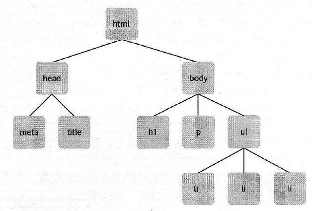
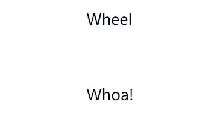

JavaScript DOM编程艺术 小记
---
[本书链接：JavaScript DOM编程艺术(第2版)](https://www.amazon.cn/dp/B004VJM5KE/ref=sr_1_1?ie=UTF8&qid=1525569169&sr=8-1&keywords=DOM%E7%BC%96%E7%A8%8B%E8%89%BA%E6%9C%AF)

前言
---
本书的真正目的是让大家理解DOM脚本编程技术背后的思路和原则。平稳退化、渐进增强、以用户为中心的设计对任何前端 Web 开发工作都非常重要。

目录
---
* [第1章 JavaScript简史](#1)
* [第2章 JavaScript语法](#2)
* [第3章 DOM](#3)
* [第4章 案例研究：JavaScript图片库](#4)
* [第5章 最佳实践](#5)
* [第6章 案例研究：图片库改进版](#6)
* [第7章 动态创建标记](#7)
* [第8章 充实文档的内容](#8)
* [第9章 CSS DOM](#9)
* [第10章 用JavaScript实现动画效果](#10)
* [第11章 HTML5](#11)
* [第12章 综合示例](#12)

---

#### 第1章 JavaScript简史

JavaScript 是 NetScape 公司与 Sun 公司合作开发的脚本语言，它的出现使得网页的内容不再局限于枯燥的文本，可交互性得到显著改善。JavaScript 和 Java 实际上并没有任何联系。 Java 在理论上可以部署在任何环境，但 JavaScript 只倾向于应用在 Web 浏览器。

[DOM](#3) 是一套对文档的内容进行抽象和概念化的方法。

W3C 对 DOM 的定义： 一个与系统平台和编程语言无关的接口，程序和脚本可以通过这个接口动态地访问和修改文档的内容、结构和形式。

关于早期浏览器战争不作详述，只需了解到现在的大部分了浏览器都遵循最新的规范，意味着大量的任务都不必依靠分支代码即可。

---

#### 第2章 JavaScript语法

##### 2.1 准备工作
JavaScript 代码的运行必须通过 HTML/XHTML才能执行，主要有两种方式。
~~~html
<!DOCTYPE html>
<html>
<head>
	
	
</head>
<body>
	
</body>
</html>
~~~
第一是将代码放到文档 `<head>`标签中的 `
	<link rel="stylesheet" type="text/css" href="circles.css">
	

	
</head>
<body>
	<canvas id="myCanvas" resize></canvas>
</body>
</html>
~~~

效果如下。声音就听不到了。

>

#### 第12章 综合示例

利用之前章节的知识做了一个小站点: [代码](./raw/code/c12)。

`@import url()` 可以将多个css样式表导入合并成一个样式表, 便于修改;

高亮当前页面标签和单击内部链接只显示对应内容都非常有用。

---
全书的知识点就简单地总结到这，模糊的地方还是要结合代码多敲。
